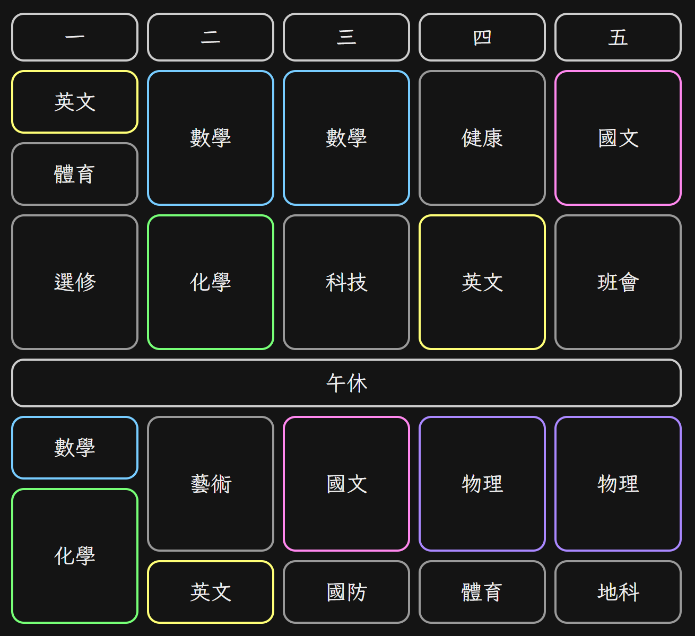

# Timetable

## Description

Just a simple webpage to show the timetable

## How to Use

First time:
- Make sure you have [Node.js](https://nodejs.org/) and [NPM](https://www.npmjs.com/) installed
- Execute `npm install` to install dependencies

Later:
- Execute `npm run dev` and open [http://localhost:5173/](http://127.0.0.1:5173/)
- Edit and save `src/config.ts` to see the changes